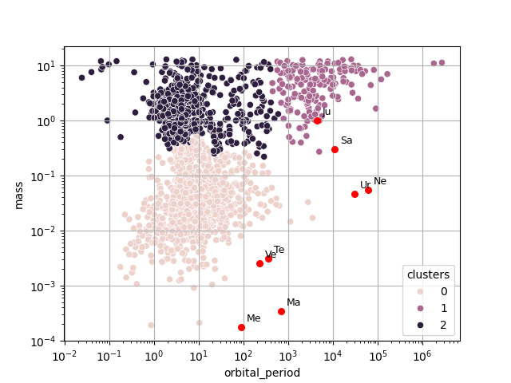
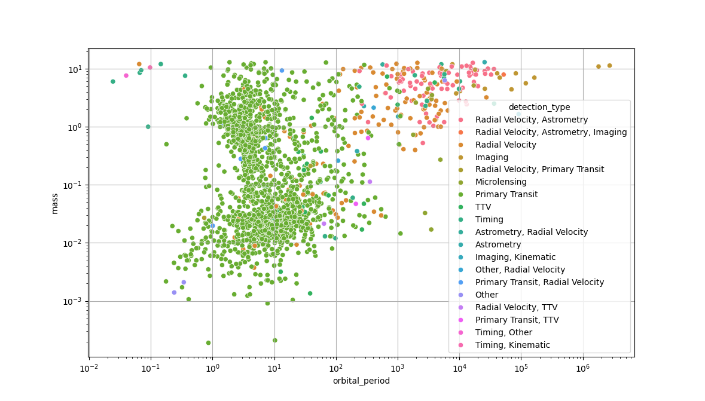

# Les différents types d'exoplanètes

_"I don't like planets. There's dust and weather, and something always wants to eat the humans."_

**Martha Wells, Muderbot Diaries, Exit Strategy (2018)**

## Contexte scientifique

En 1995, les astronomes suisses Michel Mayor et Didier Queloz annoncent la découverte d'une planète orbitant autour de l'étoile 51 Pegasi, détectée à partir d'observations de l'Observation de Haute-Provence.
Il s'agit de la 1ère planète connue en dehors du système solaire, ou "**exoplanète**".
Cette découverte leur vaudra le prix Nobel de Physique en 2019.

Depuis, des milliers d'exoplanètes ont été découvertes, avec plusieurs techniques d'observation.

Le projet "**exoplanet.eu**" propose une base de donnée en ligne de toutes les exoplanètes connues.
Sur le site web du projet, il est possible de télécharger au **format CSV** un tableau contenant les caractéristiques de chacune de ces exoplanètes, à des fins d'analyse de données.

Vous pouvez consulter ce site ici : [site de exoplanet.eu](https://exoplanet.eu).

Un extrait de ce tableau a été récupéré en avril 2026 sur le site d'exoplanet.eu, que vous trouverez [ici](https://github.com/NicOudart/UVSQ_M2_NewSpace_TP_classification/blob/master/example/exoplanet_catalogue_2026.csv).

Il contient entre autres pour chaque exoplanète les 2 informations suivantes : sa **masse** (en ratio par rapport à la masse de Jupiter) et sa **période orbitale** autour de son étoile (en jours terrestres).

Nous savons qu'il existe différents types de planètes dans le système solaire (telluriques, géantes gazeuses, géantes glacées, etc.), ayant des masses et des périodes orbitales différente.
On peut donc légitimement se poser la question suivante : 

_Est-il possible de discriminer les différents types d'exoplanètes à partir de ces mêmes informations ?_

On reconnait dans cette question un problème de **partition** (ou classification non-supervisée).

## Objectifs

Lors de ce tutoriel, nous allons programmer une **chaîne de partitionnement de données** sous la forme d'un **script Python**, que nous utiliserons pour explorer les différents **types d'exoplanètes**.

Ce script Python devra :

* Importer les données du fichier CSV sous la forme d'un "DataFrame" `pandas`.

* Appliquer une transformation de mise à l'échelle aux données.

* Réaliser un partitionnement "par partition" avec la méthode des K-moyennes, en choisissant un nombre de classes optimal.

* Réaliser un partitionnement "hiérarchique" avec la méthode de la CAH, en affichant un dendrogramme.

* Analyser les caractéristiques des différentes classes afin de les labéliser.

Votre script se basera sur la bibliothèque Python `Scikit-Learn`, qui propose de nombreuses méthodes de Machine-Learning.
Nous utiliserons également la bibliothèque `pandas` pour la manipulation des données, et la bibliothèque `seaborn` pour les affichages graphiques.

|Nota Bene|
|:-|
|Il est à noter que le problème que nous cherchons à résoudre ici est en réalité déjà résolu : classifier les exoplanètes à partir de leur masse et leur période orbitale est classique en planétologie.|

## Importation des données

### Le format CSV

Pour enregistrer une base de données sous la forme d'un tableau, on utilise couramment le format **CSV** : "Comma Separated Values".

Il s'agit d'un format ouvert, compréhensible par un humain, qui peut être lu par n'importe quel éditeur de texte.
L'extension d'un fichier CSV est simplement "**.csv**".

Comme son nom l'indique, un fichier CSV s'organise de la manière suivante :

* **Chaque ligne correspond à une ligne du tableau**. Les lignes sont séparées par un retour à la ligne "\n".

* Au sein d'une ligne, **les éléments de chaque colonnes sont séparés par des virgules** ",".

* La **première ligne** est souvent considérée comme l'**en-tête** du tableau (le nom des colonnes).

D'où le nom "Comma Separated Values".

En général, les **colonnes** représentent les différentes **variables**, et les **lignes** les différents **individus** de la base de données.

Voici un exemple de tableau : 

|Name     |Mass |Period |
|:-------:|:---:|:-----:|
|109 Psc b|5.743|1075.4 |
|112 Psc c|9.866|36336.7|
|14 Her b |8.900|1767.56|
|14 Her c |7.900|52160.0|
|51 Eri Ab|4.100|10260.0|

Sa conversion en format CSV sera tout simplement :

~~~
Name,Mass,Period
109 Psc b,5.743,1075.4
112 Psc c,9.866,36336.7
14 Her b,8.900,1767.56
14 Her c,7.900,52160.0
51 Eri Ab,4.100,10260.0
~~~

Vous pouvez ouvrir dans un éditeur de texte notre fichier CSV extrait de exoplanet.eu, pour essayer d'en comprendre le contenu.

Il peut être importé par la plupart des logiciels tableurs (Excel, OpenOffice Calc), et sous Python avec la bibliothèque `pandas`.

### Importation avec Pandas

Pour importer un tableau sous Python à partir d'un fichier CSV, nous allons utiliser la bibliothèque `pandas`.

Il ne faudra donc pas oublier d'importer `pandas` en début de script :

~~~
import pandas as pd
~~~

Pour importer notre fichier, il faudra utiliser la méthode `read_csv`.
Par exemple, pour un fichier CSV se situant à un chemin `input_path` sur votre ordinateur :

~~~
df_dataset = pd.read_csv(input_path)
~~~

Le tableau sera stocké sous la forme d'un **DataFrame** nommé `df_dataset`.

**Ajoutez à votre script Python l'importation de notre fichier CSV**.

Vous pouvez tester votre script pour vérifier que le DataFrame contient bien le tableau attendu.

### Tri des données

En regardant le contenu du tableau chargé, vous avez dû remarquer qu'il contient 98 colonnes et 6414 lignes, soit **98 variables** et **6414 exoplanètes**.

Or, pour notre problème nous n'avons besoin que de 2 variables : la masse et la période orbitale de chaque planète.

Il nous faut donc sélectionner les 2 colonnes correspondantes : `mass` et `orbital_period`.
Ceci est faisable avec un simple :

~~~
df_dataset = df_dataset[['mass','orbital_period']]
~~~

**Ajoutez à votre script Python la sélection de ces 2 colonnes du DataFrame.**

Si vous regardez attentivement le DataFrame obtenu, vous devriez vous apercevoir que certaines lignes contiennent des `nan`.

Il s'agit des initiales de "**Not A Number**" : une valeur donnée au résultat d'une opération invalide, selon la norme IEEE 754.
Les NaN sont souvent utilisés en analyse de données pour représenter une **valeur manquante**.
C'est le cas ici.

Nous pouvons donc éliminer du tableau les lignes contenant un NaN pour au moins une des 2 variables.

Pour ce faire, il suffit d'utiliser la méthode `dropna` des DataFrame :

~~~
df_dataset = df_dataset.dropna()
~~~

**Ajoutez à votre script Python l'élimination des lignes du DataFrame contenant des NaN.**

Si vous testez à nouveau votre script Python, le nouveau DataFrame obtenu après tri devrait contenir 2 colonnes et 1989 lignes.
Nous avons donc **1989 exoplanètes** dont la masse et la période orbitale sont connues.

## Analyse des données

Le réflexe à avoir lorsque l'on veut réaliser une partition de données, et de réaliser au préalable une analyse visuelle des données afin de vérifier si vouloir réaliser une partition a ici un sens.

Pour les affichages graphiques, nous allons utiliser la bibliothèque `seaborn`.
Il ne faut donc pas oublier de l'ajouter au début de votre script :

~~~
import seaborn as sns
~~~

Dans notre exemple, nous sommes en 2D, car nous n'avons retenu que 2 variables.
Visualiser les données est donc ici très simple.

Pour commencer, vous pouvez afficher un **nuage de points** des exoplanètes en fonction de leur masse et période orbitale.

Il suffit d'utiliser la méthode `scatterplot` de `seaborn` : 

~~~
sns.scatterplot(data=df_dataset,x='orbital_period',y='mass')
~~~

Si vous affichez votre nuage de points avec des axes linéaires, vous obtenez probablement un résultat illisible.

C'est normal, comme beaucoup de grandeurs en physique, la masse et la période orbitale des exoplanètes varient sur plusieurs ordres de grandeurs.

Il vaut donc mieux afficher le graphique avec des axes **logarithmiques**.
Ceci est possible en ajoutant à votre programme :

~~~
plt.xscale("log")
plt.yscale("log")
~~~

**Ajoutez cet affichage graphique à votre script Python.**

Vous devriez alors obtenir un graphique similaire à celui-ci :

On peut déjà noter que quelques groupes de points se démarquent.
Mais la grande quantité de points rend difficile à visualiser la densité de planètes dans certaines zones du graphique.

Une solution pour aider à visualiser les "groupes" d'exoplanètes dans le graphique est d'afficher un **histogramme 2D**.

Avec `seaborn`, il suffit d'utiliser la méthode `histplot`, en n'oubliant pas d'indiquer que l'on veut des axes logarithmiques :

~~~
sns.histplot(data=df_dataset,x="orbital_period",y="mass",bins=30,log_scale=(True,True),cbar=True)
~~~

Le paramètres `bin` permet de définir le nombre d'intervalles de l'histogramme selon l'axe horizontal et l'axe vertical.

**Ajoutez ce nouvel affichage graphique à votre script Python.**

Vous devriez alors obtenir un graphique similaire à celui-ci :

A partir de ces graphiques, posez-vous les questions suivantes :

_Remarquez-vous des groupes d'exoplanètes ressortir ? Si oui, combien ?_

_Pensez-vous que la partitionnement a ici un sens ? Va-t-il être simple ?_

Ces questions font appel aux 2 critères d'une "bonne partition" :

* Les individus d'une même classe doivent être les plus similaires possibles.

* Les classes doivent être les plus différentes possibles.

Il faudra garder ces critères en tête pendant la suite de ce tutoriel.

## Préparation des données

Maintenant que nous avons vérifié la pertinence de vouloir séparer différentes classes d'exoplanètes à partir de leur masse et de leur période orbitale, nous pouvons passer à la **préparation des données** pour le paritionnement.

En effet, nous avons vu précédemment qu'en échelle linéaire, il était difficile de distinguer quoi que ce soit dans nos données.
Une méthode de partitionnement aura donc également du mal à séparer des groupes ayant un sens physique dans ces données si nous n'opérons pas une **transformation**.

Assez logiquement, nous allons opérer ici une **transformation logarithmique**.

Pour définir une transformation à appliquer à des données, on peut se servir de la méthode `FunctionTransformer` de la bibliothèque "Scikit-Learn" (`sklearn`).

Il ne faut donc pas oublier de l'importer en début de script : 

~~~
from sklearn.preprocessing import FunctionTransformer
~~~

Il faut ensuite définir la fonction que l'on veut appliquer aux données pour réaliser notre transformation :

~~~
log_transformer = FunctionTransformer(func=np.log10,inverse_func=lambda x: 10**x)
~~~

Il est possible de définir la fonction inverse, afin de pouvoir facilement revenir aux données de base.

Il est également à noter que si des paramètres de la fonction dépendent des données (comme le centrage-réduction par exemple), il faudra d'abord ajuster la fonction aux données avec la méthode `fit`.

On peut alors appliquer la transformation que nous venons de définir à nos données :

~~~
df_dataset[['orbital_period','mass']] = pd.DataFrame(log_transformer.transform(df_dataset))
~~~

**Ajoutez la transformation logarithmique des données à votre script Python, avant tout partitionnement**.

## Partitionnement par partition.

Nous allons à présent essayer de **partitionner** nos données en différentes classes d'exoplanètes.

Pour ce faire, nous allons commencer par appliquer la très classique méthode des **K-moyennes**.

### Les K-moyennes

Les **K-moyennes** sont une méthode de partionnement "**par partition**", c'est-à-dire que l'on sépare les données en classes, sans établir de liens entre les classes obtenues.

Il s'agit d'un algorithme **itératif**, cherchant à réduire à chaque itération ce que l'on appelle "**l'inertie intra-classe**", à partir d'une partition initiale aléatoire. 
L'idée est d'essayer de faire converger le modèle vers la partition minimisant cette inertie intra-classe.
Le **nombre de classes** est un paramètre d'entrée de l'algorithme.

Il existe une implémentation `sklearn` des K-moyennes, que nous allons utiliser lors de ce tutoriel.

N'oubliez donc pas de l'importer en début de script :

~~~
from sklearn.cluster import KMeans
~~~

Pour initialiser un modèle `km` des K-moyennes avec `sklearn`, pour un nombre de classes `k`, il suffit d'écrire :

~~~
km = KMeans(n_clusters=k,random_state=0)
~~~

L'initialisation des K-moyennes étant aléatoire, le paramètre `random_state` permet de figer la graine aléatoire, afin de toujours obtenir le même résultat en sortie.

Pour obtenir la partition des données sous la forme d'une variable `clusters`, il suffit d'utiliser la méthode `fit_predict` :

~~~
clusters = km.fit_predict(df_dataset)
~~~

La variable de sortie contiendra les classes attribuées à chaque individu, sous la forme de numéros.

Enfin, l'inertie intra-classe de la partition obtenue est stockée dans l'attribut `inertia_`.
Pour la récupérer sous la forme d'une variable `inertia`, il suffit d'écrire :

~~~
inertia = km.inertia_
~~~

Vous trouverez dans la section suivante un rappel sur ce qu'est l'inertie intra-classe et ce qu'elle représente.

### Rappels sur l'inertie intra-classe

L'**inertie d'une classe** $i$ contenant $n_i$ individus est définie comme la somme des distances $d$ au barycentre $g_i$ de la classe :

$I_i = \sum_{j=1}^{n_i} d(x_{i,j},g_i)^2$

où chaque $x_{i,j}$ est un vecteur contenant les réalisations des différentes features pour un individu de la classe $i$.

On définit le **barycentre** comme :

$g_i = \frac{1}{n_i} \sum_{j=1}^{n_i} x_{i,j}$

Et la mesure de distance choisie est en général la distance euclidienne.

On définit alors l'**inertie intra-classe** comme étant la somme des inerties des $k$ classes :

$I = \sum_{i=1}^{k} I_i = \sum_{i=1}^{k} \sum_{j=1}^{n_i} d(x_{i,j},g_i)^2$

Il s'agit d'un indicateur de la **similarité des individus au sein de chaque classe**.

Par opposition, l'**inertie inter-classe** est quant à elle définie comme :

$J = \sum_{i=1}^{k} n_i d(g_i,g)^2$

avec $g = \frac{1}{\sum_{i=1}^{k} n_i} \sum_{i=1}^{k} \sum_{j=1}^{n_i} x_{i,j}$ le barycentre du jeu de données complet.

Il s'agit d'un indicateur de la **dissimilarité des différentes classes**.

Nous avons dit plus tôt que lors d'une partition de données, on cherche à minimiser la similarité intra-classe, et maximiser la dissimilarité inter-classe, ce qui revient à dire **minimiser $I$** et **maximiser $J$**.

Or, la somme $T = I+J$, aussi appelée "**inertie totale**" est **constante** pour un **même jeu de donnée** et un **même nombre de classes**, quelque soit la partition choisie.

D'où le fait que les K-moyennes cherchent juste à **minimiser l'inertie intra-classe** .

### La méthode du coude

Comme nous l'avons indiqué précédemment, le **nombre de classes** de la partition à réaliser est **une entrée** de l'algorithme des K-moyennes.

_Mais comment le choisir objectivement sans a priori sur la structure des données ?_

Si l'inertie intra-classe est constante pour un nombre de classes fixe, l'inertie intra-classe de la partition optimale pour un nombre de classes donné va **diminuer si on augmente le nombre de classes**.

Ceci est lié au fait que le nombre d'individus par classe diminue à mesure que l'on augmente le nombre de classes.

Mais attention ! Choisir le nombre classes donnant l'inertie intra-classe la plus faible ne donnera pas un résultat satisfaisant : une partition ayant autant de classes que d'individu aura une inertie intra-classe de 0, mais ne servira pas à grand chose...

C'est pourquoi on va plutôt chercher le nombre de classes à partir duquel l'inertie intra-classe ne diminue plus significativement.
C'est ce que l'on appelle la **méthode du coude**.

Le principe est le suivant : on applique les K-moyennes à nos données pour un nombre de classes croissant, puis on affiche l'inertie intra-classe obtenue pour chaque nombre de classes.
On retiendra le nombre de classes pour lequel la courbe forme un "**coude**".
D'où le nom de la méthode.

**Ajoutez l'affichage de l'inertie intra-classe en fonction du nombre de classes à votre script Python**.

Vous devriez obtenir un graphique similaire à celui-ci :

_A partir de ce graphique, quel nombre de classes choisiriez-vous ?_

### Résultat

Admettons que vous ayez choisi un nombre de classes égal à 3.

On peut initialiser un nouveau modèle `km` pour 3 classes, récupérer la partition sous la forme d'une variable `clusters`, et l'ajouter comme une nouvelle colonne `clusters` au DataFrame `df_dataset` avec le programme :

~~~
km = KMeans(n_clusters=3,random_state=0)

clusters = km.fit_predict(df_dataset)

df_dataset['clusters'] = clusters

df_dataset[['orbital_period','mass']] = pd.DataFrame(log_transformer.inverse_transform(df_dataset[['orbital_period','mass']]))
~~~

On notera que l'on a utilisé la fonction inverse de `log_transformer` afin de remettre les variables en échelle linéaire pour l'affichage.

**Ajoutez à votre script Python le partitionnement de nos données en 3 classes, avec les K-moyennes**.

Affichez ensuite le résultat sous la forme d'un nuage de points, avec des couleurs différentes pour les 3 classes.

Vous devriez obtenir un graphique similaire à celui-ci :

Cette partition est probablement très similaire aux groupes de planètes que vous auriez instinctivement tracés à la main.

_Mais comment juger objectivement le résultat d'un partitionnement ?_

Il nous faut un critère de performance.

### Coefficient de silhouette

Un critère classique pour juger un partitionnement est le **coefficient de silhouette**.

Pour chaque individu de la base de données, il est définit comme :

$s(x_{i,j}) = \frac{D_2(x_{i,j})-D_1(x_{i,j})}{max(D_1(x_{i,j}),D_2(x_{i,j}))}$

Avec $D_1$ la **distance moyenne intra-classe** :

$D_1(x_{i,j}) = \frac{1}{n_i-1} \sum_{m=1,m \neq j}^{n_i} d(x_{i,m},x_{i,j})$

Il s'agit d'un indicateur de la **similarité** d'un individu au reste de sa classe : plus il est faible, plus l'individu est proche du reste de sa classe.

Et $D_2$ la **distance moyenne à la classe la plus proche** :

$D_2(x_{i,j}) = min_{1 \leq l \leq k, l \neq i}(\frac{1}{n_l} \sum_{m=1}^{n_l} d(x_{l,m},x_{i,j}))$

Il s'agit d'un indicateur de **dissimilarité** d'un individus par rapport à la classe la plus proche de la sienne : plus il est élevé, plus l'individu est séparable des autres classes

Le coefficient de silhouette est un score compris entre -1 et 1.
Si pour un individu :

* $s(x_{i,j}) \approx 1$ alors l'individu est correctement identifié à sa classe.

* $s(x_{i,j}) = 0$ alors l'individu est à la frontière entre 2 classes.

* $s(x_{i,j}) < 0$ alors l'individu est mal identifié à sa classe.

On affiche souvent les coefficients de silhouette des différents individus sous la forme d'un histogramme, avec des couleurs différentes pour les classes.

On peut aussi utiliser le coefficient de silhouette moyen $S = \frac{1}{\sum_{i=1}^{k} n_i} \sum_{i=1}^{k} \sum_{j=1}^{n_i} s(x_{i,j})$ comme mesure de la qualité générale d'une partition de données.

Il existe une implémentation du coefficient de silhouette dans `sklearn`, qu'il ne faut pas oublier d'importer en début de script Python :

~~~
from sklearn.metrics import silhouette_score,silhouette_samples
~~~

En revanche, il n'existe pas de méthode toute faite pour afficher un histogramme des valeurs du coefficient de silhouette.
Vous pouvez donc utiliser le morceau de programme suivant :

~~~
sample_scores = silhouette_samples(df_dataset,clusters)

score = silhouette_score(df_dataset,clusters)

fig, ax = plt.subplots()

y_lower = 10
for idx in range(3):
    sample_scores_idx = sample_scores[clusters == idx]
    sample_scores_idx.sort()

    size_cluster_idx = sample_scores_idx.shape[0]
    y_upper = y_lower + size_cluster_idx

    color = plt.cm.tab10(idx)
    ax.fill_betweenx(
        np.arange(y_lower, y_upper),
        0,
        sample_scores_idx,
        facecolor=color,
        edgecolor=color,
        alpha=0.7
    )

    ax.text(-0.05, y_lower + 0.5 * size_cluster_idx, str(idx))
    y_lower = y_upper + 10
    
ax.axvline(x=score,color="red",linestyle="--")

ax.set_yticks([])
ax.set_xlim([-1, 1])
ax.set_xlabel("Coefficient de silhouette",fontsize=12)
ax.set_ylabel("Classes",fontsize=12)
~~~

**Ajoutez à votre script Python l'affichage d'un histogramme de coefficients de silhouettes pour votre partition des exoplanètes**.

Vous devriez obtenir un graphique similaire à celui-ci :

_Les exoplanètes sont-elles bien attribuées à leur classe pour les 3 classes ?_

_De manière générale, comment jugez-vous cette partition ?_

## Partitionnement hiérarchique

Si la méthode de partitionnement "par partition" que nous venons de voir est peu gourmande en temps de calcul, pour un résultat plutôt satisfaisant, elle ne permet pas en revanche de **tracer des liens** entre les classes : on ne sait pas quelles classes sont les plus proches ou les plus éloignées.

Les méthodes de partitionnement "**hiérarchique**" en revanche, permettent d'établir les liens entre les classes, au prix d'un temps de calcul plus élevé.

Nous allons appliquer à nos données la plus classique des méthodes hiérarchiques : la **Classification Ascendante Hiérachique** (ou CAH).

### CAH

La **CAH** est une méthode **itérative**, **fusionnant** les 2 classes **les plus similaires** à chaque itération.

Elle s'initialise en considérant chaque individu comme unique représentant de sa propre classe : on a autant de classes que d'individu, **l'inertie intra-classe est nulle**.

Elle se termine une fois que toutes les classes ont été fusionnées : on a une unique classe, **l'inertie inter-classe est nulle**.

Toutes les fusions sont **gardées en mémoire**, de manière à pouvoir choisir la partition ayant le **nombre de classes optimal** a posteriori.

Cette méthode implique donc de choisir un **critère de similarité** entre 2 classes.
Voici les 4 principaux critères utilisables par la CAH pour mesurer la similarité entre 2 classes :

* **Lien simple** : la distance minimale entre 2 individus issus de ces 2 classes.

* **Lien complet** : la distance maximale entre 2 individus issus de ces 2 classes.

* **Lien moyen** : la moyenne des distances entre tous les couples d'individus issus des 2 classes possibles.

* **Critère de Ward** : l'augmentation de l'inertie intra-classe quand les 2 classes sont fusionnées.

Le choix de critère dépend de la définition de "similarité" la plus appropriée pour un problème donné.

Lors de ce tutoriel, nous utiliserons le **critère de Ward**, qui est souvent le choix par défaut.

### Dendrogramme

Comme nous l'avons expliqué plus tôt, les fusions sont gardées en mémoire par la CAH, afin que nous puissions choisir une partition pour un nombre de classe donné a posteriori.

Pour réaliser ce choix, on affiche en général un type de représentation graphique des différentes fusion appelé "**dendrogramme**".
Il s'agit d'un arbre représentant les liens entre classes (en abscisse) et leurs distances (en ordonnée).

Pour générer un dendrogramme, on peut utiliser la méthode `dendrogram` de `scipy`.
Il faut donc penser à l'importer en début de script Python :

~~~
from scipy.cluster.hierarchy import dendrogram
~~~

En revanche, il n'existe pas de méthode toute faite pour afficher le dendrogramme sous la forme d'un graphique.
Voici donc une fonction Python pour le faire, qui fait elle-même appel à la méthode `dendrogram` de `scipy` :

~~~
def plot_dendrogram(model, **kwargs):
    
    counts = np.zeros(model.children_.shape[0])
    n_samples = len(model.labels_)

    for i, merge in enumerate(model.children_):
        current_count = 0
        for child_idx in merge:
            if child_idx < n_samples:
                current_count += 1
            else:
                current_count += counts[child_idx - n_samples]
        counts[i] = current_count

    linkage_matrix = np.column_stack([
        model.children_,
        model.distances_,
        counts
    ]).astype(float)

    dendrogram(linkage_matrix, **kwargs)
~~~

On peut ensuite initialiser un modèle `hca` de **CAH** avec le **lien de Ward**, et générer un partitionnement avec la méthode `fit` :

~~~
hca = AgglomerativeClustering(distance_threshold=0,n_clusters=None,linkage='ward')
hca.fit(df_dataset)
~~~

Les paramètres pour initialiser `hca` on été choisis pour réaliser toutes les itérations de la CAH, jusqu'à ce que tous les individus soient dans une même classe.
Nous verrons qu'il est également possible de faire s'arrêter l'algorithme lorsque le nombre de classes désiré est atteint.

Enfin, on peut réaliser l'affichage du dendrogramme avec notre fonction `plot_dendrogram` et `matplotlib` :

~~~
plt.figure()
plot_dendrogram(hca,truncate_mode="level")
plt.xlabel("Classes",fontsize=12)
plt.ylabel("Distance entre classes",fontsize=12)
plt.xticks([])
plt.show()
~~~

N'oubliez pas d'importer `matplotlib` en début de script Python avec :

~~~
import matplotlib.pyplot as plt
~~~

**Ajoutez à votre script Python l'affichage d'un dendrogramme de la partition de nos données réalisée par la CAH**.

Vous devriez obtenir un graphique similaire à celui-ci :

_Ce dendrogramme confirme-t-il le choix de 3 classes que nous avons fait pour le partitionnement "par partition" ?_

### Résultat

Nous allons à présent utiliser la CAH pour obtenir une partition des exoplanètes en 3 classes.

Comme pour le partitionnement "par partition", nous pouvons initialiser un nouveau modèle `hca` pour 3 classes, récupérer la partition sous la forme d'une variable `clusters`, et l'ajouter comme une nouvelle colonne `clusters` au DataFrame `df_dataset` avec le programme :

~~~
hca = AgglomerativeClustering(n_clusters=3,linkage='ward')

clusters = hca.fit_predict(df_dataset)

df_dataset['clusters'] = clusters

df_dataset[['orbital_period','mass']] = pd.DataFrame(log_transformer.inverse_transform(df_dataset[['orbital_period','mass']]))
~~~

**Ajoutez à votre script Python le partitionnement de nos données en 3 classes, avec la CAH**.

Affichez ensuite le résultat sous la forme d'un nuage de points, avec des couleurs différentes pour les 3 classes.

Vous devriez obtenir un graphique similaire à celui-ci :

_Le résultat est-il différent de celui obtenu avec le partitionnement "par partition" ?_

Vous pouvez essayer de changer le type de lien utilisé (simple, complet ou moyen), pour voir l'effet sur la partition obtenue.

## Labélisation

### Caractérisation des classes

L'étape ultime de tout partitionnement est la **labélisation** : identifier à quoi correspondent les différentes classes obtenues, et vérifier si elles ont un sens physique.

Pour ce faire, on va chercher à **caractériser** chaque classe par des **indicateurs statistiques** (moyenne, médiane, écart-type, quantiles, etc.).

Il existe des méthodes `mean`, `median`, `quantile` des DataFrames pour calculer ces indicateurs.

**Ajoutez à votre script Python le calcul de la médiane et des pourcentiles 1% et 99% de chaque variable (masse et période orbitale) pour les 3 classes déterminées par les K-moyennes ou la CAH**.

_Quelles sont les caractéristiques des 3 types d'exoplanètes déterminés par notre partitionnement ? Quel label donneriez-vous alors chacune de ces classes ?_

### Contexte planétologique

Pour vous aider à attribuer des labels plus précis à chacune des classes, voici un peu de **contexte planétologique**.

Tout d'abord, voici quelques grands types d'exoplanètes identifiées par les astronomes, et leurs caractéristiques :

* On appelle « **Jupiter chaud** » une exoplanète gazeuse ayant une masse du même ordre de grandeur que Jupiter, mais avec une période orbitale de l’ordre de quelques jours. 
Le terme « chaud » vient du fait qu’une rotation aussi rapide implique une orbite proche de son étoile (3ème loi de Kepler).

* On appelle « **Jupiter froid** » une exoplanète gazeuse ayant une masse du même ordre de grandeur que Jupiter, mais avec une période orbitale de plusieurs milliers de jours. 
Par opposition aux « Jupiters chauds », le terme « froid » vient du fait qu’une rotation plus lente implique une orbite plus loin de son étoile.
 
* On appelle « **Neptunienne** » ou « **Mini-Neptune** » une exoplanète gazeuse ayant une masse similaire ou inférieure à 0.05 masses de Jupiter (environ la masse de Neptune).

* On appelle « **Super-Terre** » une exoplanète tellurique ayant une masse supérieure à celle de la Terre, mais inférieure à 0.03 masses de Jupiter (10 masses terrestres environ).

_A partir de ces informations, quel label donneriez-vous à chacune de vos 3 classes ?_

### Discussion

Une des grandes difficulté de la labélisation est de s'assurer que les labels donnés ont un **sens physique intéressant**.

Voici les masses (en masses de Jupiter) et périodes orbitales (en jours) des planètes du système solaire :

|Planète|Masse  |Période orbitale|
|:-----:|:-----:|:--------------:|
|Mercure|0.00017|88.0            |
|Vénus  |0.00257|224.7           |
|Terre  |0.00315|365.3           |
|Mars   |0.00034|687.0           |
|Jupiter|1.00000|4332.6          |
|Saturne|0.29946|10759.2         |
|Uranus |0.04573|30688.5         |
|Neptune|0.05395|60182.0         |

**Tracez ces 8 planètes par-dessus les nuages de points que vous avez obtenus après partitionnement**.

Vous devriez obtenir un graphique similaire à celui-ci pour le résultat de la CAH :

_Les planètes du système solaire ont-elles l'air de faire partie d'une de nos 3 classes ?_

Clairement, hormis pour Jupiter (et peut-être Saturne), il est difficile de ranger les planètes du système solaire dans une des 3 classes que nous avons déterminées.

_Mais d'où vient le problème ? Le système solaire est-il si unique ?_

Vous l'aurez probablement deviné : **la méthode de détection !**

En effet, les méthodes actuelles ne permettent pas encore de détecter des planètes aussi petites ou avec des périodes orbitales aussi faibles que celles du système solaire.
Il y a donc probablement beaucoup de types d'exoplanètes que nous ne pouvons tout simplement pas observer.

De plus, parmi les exoplanètes détectables, **notre observation est probablement biaisée !** 

Par exemple, une plus grande quantité d'exoplanètes d'un certain type dans nos données ne veut pas nécessairement dire qu'il s'agit d'un type plus commun.
Il peut juste s'agir d'un type plus facilement détectable.

De la même manière, les classes que notre partition séparent pourraient être simplement liées aux différentes méthodes d'observation.

_Comment vérifier que nous ne sommes pas biaisés par les méthodes d'observation ?_

Si vous reprenez le fichier CSV, vous verrez qu'il existe une colonne `detection_type`, correspondant au nom de la méthode de détection employée pour découvrir chaque exoplanète.

**Affichez un nuage de point du même type que ceux tracés précédemment, mais en mettant une couleur différente pour chaque méthode de détection**.

Vous devriez obtenir un graphique similaire à celui-ci :

2 de nos 3 classes contiennent quasi-exclusivement des exoplanètes détectées par la **méthode du transit**.

Cette méthode consiste à mesurer la baisse de luminosité observée au passage de la planète dans l'axe entre son étoile et la Terre.
Elle a non seulement tendance à favoriser la découverte d'exoplanètes de taille plutôt importante, mais surtout de période orbitale courte.
D'où le fait qu'elle soit liée à ces 2 classes.

1 de nos 3 classes est plutôt associée à la **méthode des vitesses radiales** et à l'**imagerie directe**.

On peut donc légitimement si certaines classes ne traduisent pas plutôt une différence de méthode d'observation plutôt que des types d'exoplanètes bien distincts.
Mais la méthode d'observation pouvant favoriser certains types d'exoplanètes, c'est peut-être les 2.
Difficile à dire...

La leçon à en tirer : **il faut toujours réfléchir à la pertinence des classes que l'on obtient au moment de labéliser une partition de données !**

---

**C'était le dernier TP de ce cours !**

N'hésitez pas à reprendre les différents tutoriels chez vous.