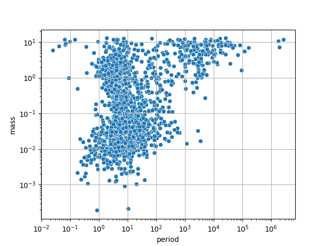
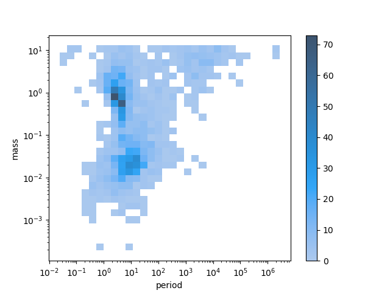
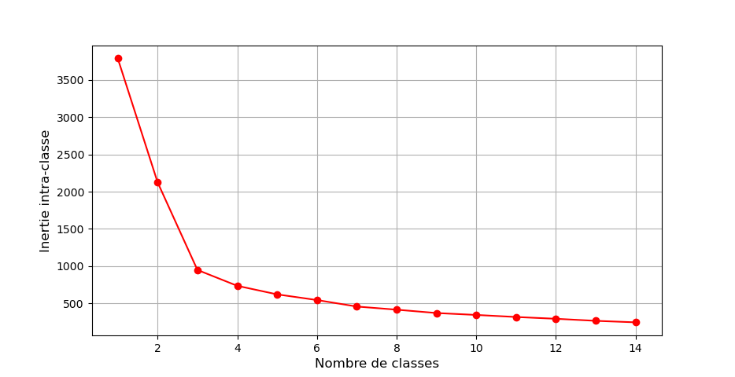
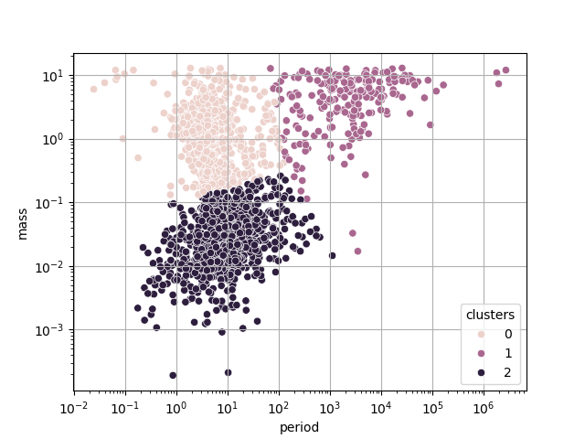
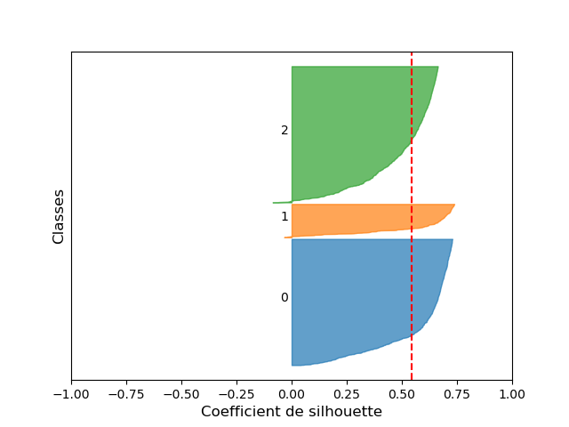
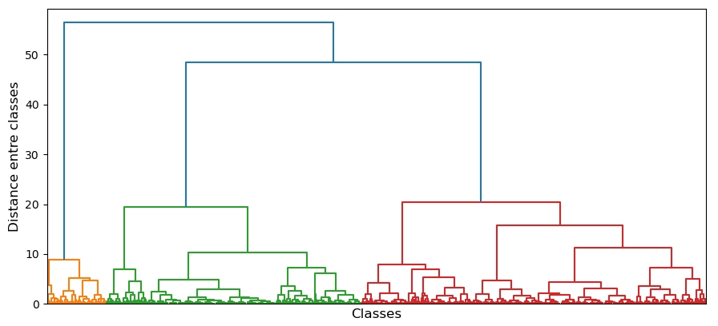
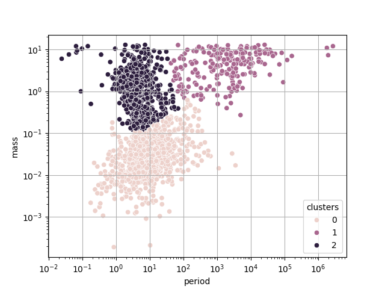

# Les différents types d'exoplanètes

_"I don't like planets. There's dust and weather, and something always wants to eat the humans."_

**Martha Wells, Muderbot Diaries, Exit Strategy (2018)**

## Contexte scientifique

En 1995, les astronomes suisses Michel Mayor et Didier Queloz annoncent la découverte d'une planète orbitant autour de l'étoile 51 Pegasi, détectée à partir d'observations de l'Observation de Haute-Provence.
Il s'agit de la 1ère planète connue en dehors du système solaire, ou "**exoplanète**".
Cette découverte leur vaudra le prix Nobel de Physique en 2019.

Depuis, des milliers d'exoplanètes ont été découvertes, avec plusieurs techniques d'observation.

Le projet "**exoplanet.eu**" propose une base de donnée en ligne de toutes les exoplanètes connues.
Sur le site web du projet, il est possible de télécharger au **format CSV** un tableau contenant les caractéristiques de chacune de ces exoplanètes, à des fins d'analyse de données.

Vous pouvez consulter ce site ici : [site de exoplanet.eu](https://exoplanet.eu).

Un extrait de ce tableau a été récupéré en avril 2026 sur le site d'exoplanet.eu, que vous trouverez [ici](https://github.com/NicOudart/UVSQ_M2_NewSpace_TP_classification/blob/master/example/exoplanet_catalogue_2026.csv).

Il contient entre autres pour chaque exoplanète les 2 informations suivantes : sa **masse** (en ratio par rapport à la masse de Jupiter) et sa **période orbitale** autour de son étoile (en jours terrestres).

Nous savons qu'il existe différents types de planètes dans le système solaire (telluriques, géantes gazeuses, géantes glacées, etc.), ayant des masses et des périodes orbitales différente.
On peut donc légitimement se poser la question suivante : **Est-il possible de discriminer les différents types d'exoplanètes à partir de ces mêmes informations ?**

## Objectifs

Lors de ce tutoriel, nous allons programmer une **chaîne d'analyse de données** sous la forme d'un **script Python**, que nous utiliserons pour explorer les différents **types d'exoplanètes**.

Ce script Python devra :

* Importer les données du fichier CSV sous la forme d'un "DataFrame" Pandas.

* Appliquer une transformation de mise à l'échelle aux données.

* Réaliser un partitionnement "par partition" avec la méthode des K-moyennes, en choisissant un nombre de classes optimal.

* Réaliser un partitionnement "hiérarchique" avec la méthode de la CAH, en affichant un dendrogramme.

* Analyser les caractéristiques des différentes classes afin de les labéliser.

Votre script se basera sur la bibliothèque Python "**Scikit-Learn**", qui propose de nombreuses méthodes de Machine-Learning.
Nous utiliserons également la bibliothèque "Pandas" pour l'importation et la manipulation des données.

|Nota Bene|
|:-|
|Il est à noter que le problème que nous cherchons à résoudre ici est en réalité déjà résolu : classifier les exoplanètes à partir de leur masse et leur période orbitale est classique en planétologie.|

## Importation des données

### Le format CSV

Pour enregistrer une base de données sous la forme d'un tableau, on utilise couramment le format **CSV** : "Comma Separated Values".

Il s'agit d'un format ouvert, compréhensible par un humain, qui peut être lu par n'importe quel éditeur de texte.
L'extension d'un fichier CSV est simplement "**.csv**".

Comme son nom l'indique, un fichier CSV s'organise de la manière suivante :

* **Chaque ligne correspond à une ligne du tableau**. Les lignes sont séparées par un retour à la ligne "\n".

* Au sein d'une ligne, **les éléments de chaque colonnes sont séparés par des virgules** ",".

* La **première ligne** est souvent considérée comme l'**en-tête** du tableau (le nom des colonnes).

D'où le nom "Comma Separated Values".

En général, les **colonnes** représentent les différentes **variables**, et les **lignes** les différents **individus** de la base de données.

Voici un exemple de tableau : 

|Name     |Mass |Period |
|:-------:|:---:|:-----:|
|109 Psc b|5.743|1075.4 |
|112 Psc c|9.866|36336.7|
|14 Her b |8.900|1767.56|
|14 Her c |7.900|52160.0|
|51 Eri Ab|4.100|10260.0|

Sa conversion en format CSV sera tout simplement :

~~~
Name,Mass,Period
109 Psc b,5.743,1075.4
112 Psc c,9.866,36336.7
14 Her b,8.900,1767.56
14 Her c,7.900,52160.0
51 Eri Ab,4.100,10260.0
~~~

Vous pouvez ouvrir dans un éditeur de texte notre fichier CSV extrait de exoplanet.eu, pour essayer d'en comprendre le contenu.

Il peut être importé par la plupart des logiciels tableurs (Excel, OpenOffice Calc), et sous Python avec la bibliothèque **Pandas**.

### Importation avec Pandas

Pour importer un tableau sous Python à partir d'un fichier CSV, nous allons utiliser la bibliothèque **Pandas**.

Il ne faudra donc pas oublier d'importer `pandas` en début de script :

~~~
import pandas as pd
~~~

Pour importer notre fichier, il faudra utiliser la méthode `read_csv`.
Par exemple, pour un fichier CSV se situant à un chemin `input_path` sur votre ordinateur :

~~~
df_dataset = pd.read_csv(input_path)
~~~

Le tableau sera stocké sous la forme d'un **DataFrame** nommé `df_dataset`.

**Ajoutez à votre script Python l'importation de notre fichier CSV**.

Vous pouvez tester votre script pour vérifier que le DataFrame contient bien le tableau attendu.

### Tri des données

En regardant le contenu du tableau chargé, vous avez dû remarquer qu'il contient 98 colonnes et 6414 lignes, soit **98 variables** et **6414 exoplanètes**.

Or, pour notre problème nous n'avons besoin que de 2 variables : la masse et la période orbitale de chaque planète.

Il nous faut donc sélectionner les 2 colonnes correspondantes : `mass` et `orbital_period`.

**Ajoutez à votre script Python la sélection de ces 2 colonnes du DataFrame.**

Si vous regardez attentivement le DataFrame obtenu, vous devriez vous apercevoir que certaines lignes contiennent des `nan`.

Il s'agit des initiales de "**Not A Number**" : une valeur donnée au résultat d'une opération invalide, selon la norme IEEE 754.
Les NaN sont souvent utilisés en analyse de données pour représenter une **valeur manquante**.
C'est le cas ici.

Nous pouvons donc éliminer du tableau les lignes contenant un NaN pour au moins une des 2 variables.

## Analyse des données

## Préparation des données

## Partitionnement

### K-moyennes

### CAH

## Interprétation

## Conclusion