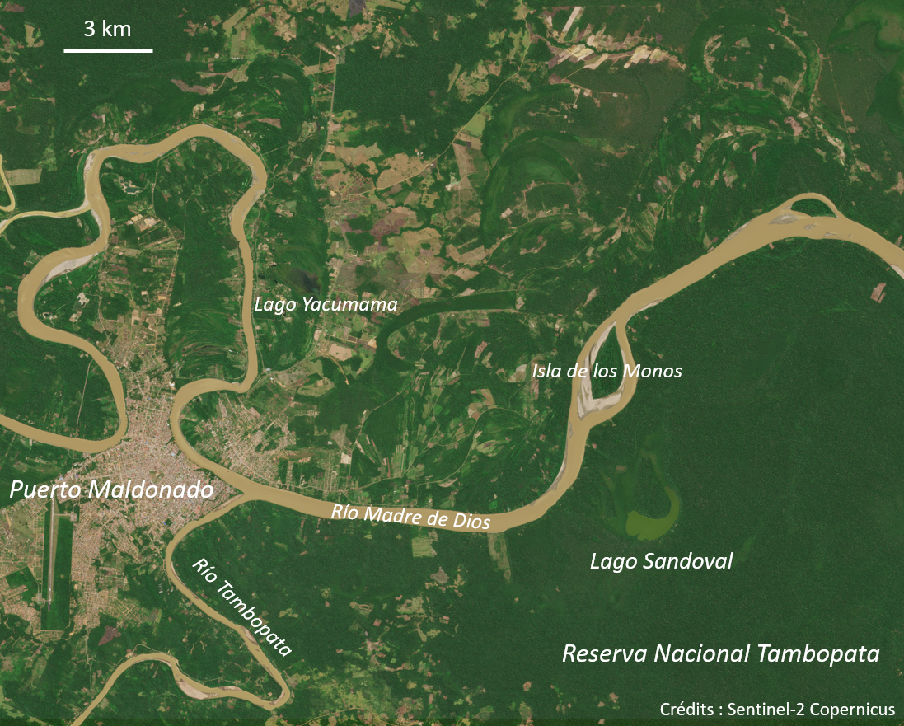

# Cartographier Puerto Maldonado avec Sentinel

_"Le seizième siècle. Des quatre coins de l'Europe, de gigantesques voiliers partent à la conquête du Nouveau Monde. À bord de ces navires, des hommes avides de rêve, d'aventure et d'espace, à la recherche de fortune. Qui n'a jamais rêvé de ces mondes souterrains, de ces mers lointaines peuplées de légendes, ou d'une richesse soudaine qui se conquerrait au détour d'un chemin de la Cordillère des Andes ? Qui n'a jamais souhaité voir le Soleil souverain guider ses pas au coeur du pays Inca, vers la richesse et l'histoire des Mystérieuses Cités d'Or ?"_

**Jean Chalopin, Les Mystérieuses Cités d'Or (1982)**

---

## Contexte scientifique

### Puerto Maldonado et déforestation

**Puerto Maldonado** est la capitale de la région de Madre de Dios au Pérou.

En plein coeur de l'Amazonie péruvienne, la ville est à la confluence des rivières Madre de Dios et Tambopata, affluents de l'Amazone.
Le lieu a attiré tour à tour les conquistadors à la recherche de la cité perdue de Païtiti, les exploitants de caoutchouc, les orpailleurs illégaux, les cultivateurs de noix du Brésil, et aujourd'hui les "éco-touristes". 

La forêt primaire a donc été exploitée depuis des siècles, ce qui implique **déforestation**, **bétonisation** et **plantation d'espèces importées**.
Néanmoins, la création en 2000 de la réserve nationale de Tambopata, au sud-est de Puerto Maldonado, a permis de **préserver une partie de la forêt primaire**, qui constitue un des biotopes les plus riches du monde.

Voici une image de la région, prise par le satellite Sentinel 2 :

On observe nettement les 2 rivières, la zone urbaine de Puerto Maldonado, les exploitations agricoles, et ce qui reste de la forêt primaire.

Puerto Maldonado est donc un exemple parfait pour étudier **la déforestation en Amazonie**.

### Sentinel 2 et chlorophylle

## Objectifs

## Importation des données

## Classification supervisée

## Entrainement

## Test

## Généralisation

---