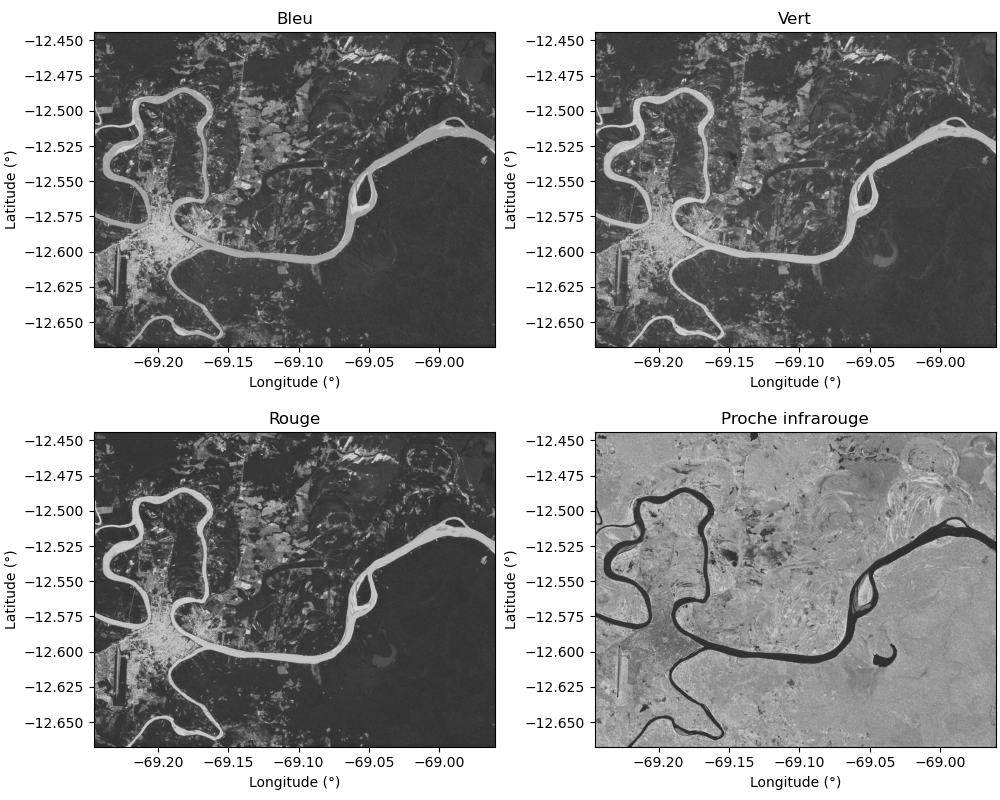
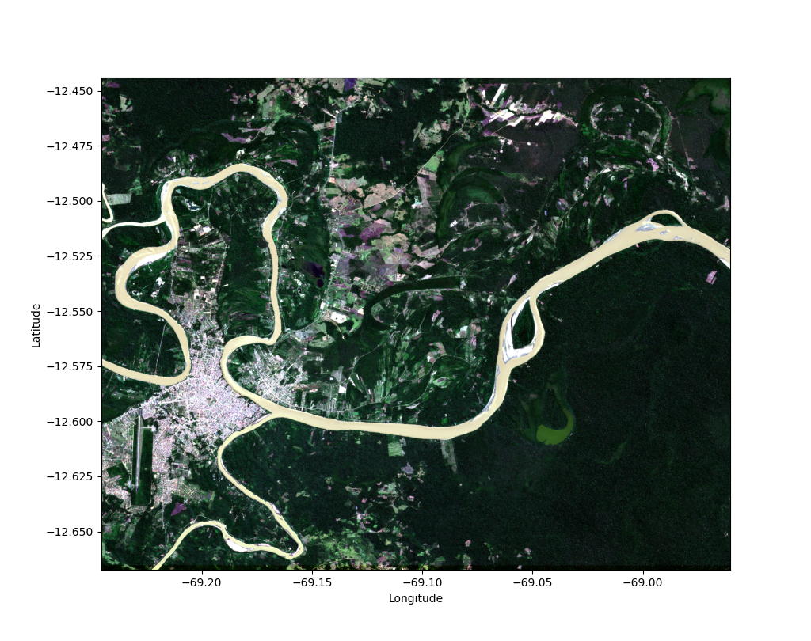
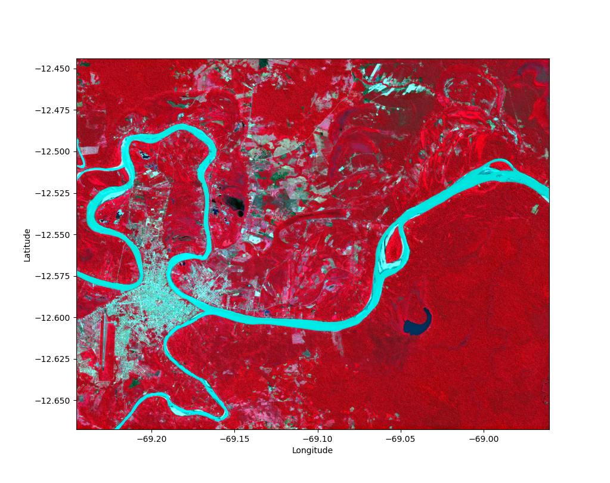

# Cartographier Puerto Maldonado avec Sentinel

_"Le seizième siècle. Des quatre coins de l'Europe, de gigantesques voiliers partent à la conquête du Nouveau Monde. À bord de ces navires, des hommes avides de rêve, d'aventure et d'espace, à la recherche de fortune. Qui n'a jamais rêvé de ces mondes souterrains, de ces mers lointaines peuplées de légendes, ou d'une richesse soudaine qui se conquerrait au détour d'un chemin de la Cordillère des Andes ? Qui n'a jamais souhaité voir le Soleil souverain guider ses pas au coeur du pays Inca, vers la richesse et l'histoire des Mystérieuses Cités d'Or ?"_

**Jean Chalopin, Les Mystérieuses Cités d'Or (1982)**

---

## Contexte scientifique

### Puerto Maldonado et déforestation

**Puerto Maldonado** est la capitale de la région de Madre de Dios au Pérou.

En plein coeur de l'Amazonie péruvienne, la ville est à la confluence des rivières Madre de Dios et Tambopata, affluents de l'Amazone.
Le lieu a attiré tour à tour les conquistadors à la recherche de la cité perdue de Païtiti, les exploitants de caoutchouc, les orpailleurs illégaux, les cultivateurs de noix du Brésil, et aujourd'hui les "éco-touristes". 

La forêt primaire a donc été exploitée depuis des siècles, ce qui implique **déforestation**, **bétonisation** et **plantation d'espèces importées**.
Néanmoins, la création en 2000 de la réserve nationale de Tambopata, au sud-est de Puerto Maldonado, a permis de **préserver une partie de la forêt primaire**, qui constitue un des biotopes les plus riches du monde.

Voici une image de la région, prise par le satellite Sentinel 2 :

On observe nettement les 2 rivières, la zone urbaine de Puerto Maldonado, les exploitations agricoles, et ce qui reste de la forêt primaire.

Puerto Maldonado est donc un exemple parfait pour étudier **la déforestation en Amazonie**.

### Sentinel 2 et chlorophylle

**Sentinel 2** est une série de satellites d'observation de la Terre faisant partie du programme Copernicus de l'ESA.

Ces satellites ont pour mission de capturer des images optiques de la surface de la Terre, **dans différentes bandes de longueur d'onde**, avec une résolution allant jusqu'à 10 m au sol.

Voici les différentes bandes dans lesquelles les satellites Sentinel 2 sont capables d'acquérir des images :

|Bande|Cible                   |Longueur d'onde|Résolution au sol|
|:---:|:----------------------:|:-------------:|:---------------:|
|B01  |Aérosols                |443 nm         |60 m             |
|B02  |Bleu                    |490 nm         |10 m             |
|B03  |Vert                    |560 nm         |10 m             |
|B04  |Rouge                   |665 nm         |10 m             |
|B05  |Red-edge                |705 nm         |20 m             |
|B06  |Red-edge                |740 nm         |20 m             |
|B07  |Red-edge                |783 nm         |20 m             |
|B08  |Proche infrarouge       |842 nm         |10 m             |
|B08A |Proche infrarouge étroit|865 nm         |20 m             | 
|B09  |Vapeur d'eau            |945 nm         |60 m             |

Deux de ces bandes sont particulièrement utiles pour étuder la **végétation** : B04 et B08.

En effet, la chlorophylle contenue dans le feuillage des plantes **absorbe fortement le rouge**, et **réfléchit fortement le proche-infrarouge**.

Cette propriété est essentielle pour les plantes :
D'une part la photosynthèse nécessite de la lumière dans le rouge.
Et d'autre part le proche-infrarouge chaufferait inutilement les feuilles, les obligeant à transpirer abondement.

Il est donc très courant en télédétection d'utiliser les bandes rouge et proche-infrarouge pour cartographier la végétation d'une région.
Il existe même un score calculé à partir de ces 2 bandes pour indiquer la présence de végétation : le **NDVI**.

### Cartographie

Nous allons essayer de cartographier la région de Puerto Maldonado à partir d'une image satellite de Sentinel 2, acquise dans 4 bandes : B02 (bleu), B03 (vert), B04 (rouge) et B08 (proche-infrarouge).

L'idée sera pour chaque pixel de l'image d'identifier automatiquement à quel type de surface il correspond, à partir de sa couleur (c'est-à-dire la réflectivité perçue dans les différentes bandes).

Nous nous concentrerons sur les 4 types de surface suivants : "eau", "ville", "champs" et "forêt".

_Mais comment entrainer un modèle à identifier le type de pixel associé à chaque pixel à partir de sa couleur ?_

On reconnait dans cette question un problème de **classification supervisée**.

## Objectifs

Lors de ce tutoriel, nous allons programmer une **chaîne de classification supervisée** sous la forme d'un **script Python**, que nous utiliserons pour **cartographier la région de Puerto Maldonado**.

Ce script Python devra :

## Importation des données

## Classification supervisée

## Entrainement

## Test

## Généralisation

---