# Cartographier Puerto Maldonado avec Sentinel

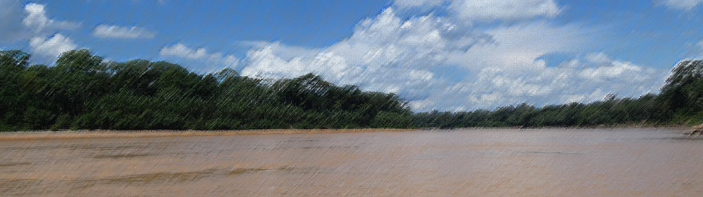

_"Le seizième siècle. Des quatre coins de l'Europe, de gigantesques voiliers partent à la conquête du Nouveau Monde. À bord de ces navires, des hommes avides de rêve, d'aventure et d'espace, à la recherche de fortune. Qui n'a jamais rêvé de ces mondes souterrains, de ces mers lointaines peuplées de légendes, ou d'une richesse soudaine qui se conquerrait au détour d'un chemin de la Cordillère des Andes ? Qui n'a jamais souhaité voir le Soleil souverain guider ses pas au coeur du pays Inca, vers la richesse et l'histoire des Mystérieuses Cités d'Or ?"_

**Jean Chalopin, Les Mystérieuses Cités d'Or (1982)**

---

## Contexte scientifique

### Puerto Maldonado et déforestation

**Puerto Maldonado** est la capitale de la région de Madre de Dios au Pérou.

En plein coeur de l'Amazonie péruvienne, la ville est à la confluence des rivières Madre de Dios et Tambopata, affluents de l'Amazone.
Le lieu a attiré tour à tour les conquistadors à la recherche de la cité perdue de Païtiti, les exploitants de caoutchouc, les orpailleurs illégaux, les cultivateurs de noix du Brésil, et aujourd'hui les "éco-touristes". 

La forêt primaire a donc été exploitée depuis des siècles, ce qui implique **déforestation**, **bétonisation** et **plantation d'espèces importées**.
Néanmoins, la création en 2000 de la réserve nationale de Tambopata, au sud-est de Puerto Maldonado, a permis de **préserver une partie de la forêt primaire**, qui constitue un des biotopes les plus riches du monde.

Voici une image de la région, prise par le satellite Sentinel 2 :

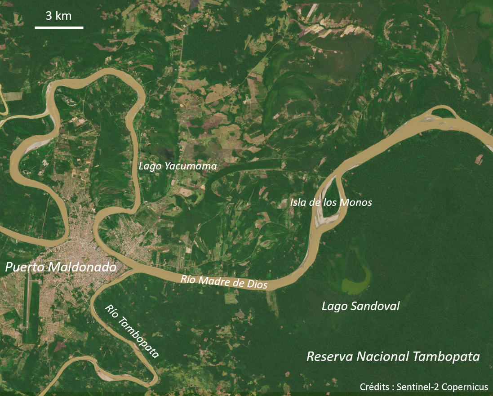

On observe nettement les 2 rivières, la zone urbaine de Puerto Maldonado, les exploitations agricoles, et ce qui reste de la forêt primaire.

Puerto Maldonado est donc un exemple parfait pour étudier **la déforestation en Amazonie**.

### Sentinel 2 et chlorophylle

**Sentinel 2** est une série de satellites d'observation de la Terre faisant partie du programme Copernicus de l'ESA.

Ces satellites ont pour mission de capturer des images optiques de la surface de la Terre, **dans différentes bandes de longueur d'onde**, avec une résolution allant jusqu'à 10 m au sol.

Voici les différentes bandes dans lesquelles les satellites Sentinel 2 sont capables d'acquérir des images :

|Bande|Cible                   |Longueur d'onde|Résolution au sol|
|:---:|:----------------------:|:-------------:|:---------------:|
|B01  |Aérosols                |443 nm         |60 m             |
|B02  |Bleu                    |490 nm         |10 m             |
|B03  |Vert                    |560 nm         |10 m             |
|B04  |Rouge                   |665 nm         |10 m             |
|B05  |Red-edge                |705 nm         |20 m             |
|B06  |Red-edge                |740 nm         |20 m             |
|B07  |Red-edge                |783 nm         |20 m             |
|B08  |Proche infrarouge       |842 nm         |10 m             |
|B08A |Proche infrarouge étroit|865 nm         |20 m             | 
|B09  |Vapeur d'eau            |945 nm         |60 m             |

Deux de ces bandes sont particulièrement utiles pour étuder la **végétation** : B04 et B08.

En effet, la chlorophylle contenue dans le feuillage des plantes **absorbe fortement le rouge**, et **réfléchit fortement le proche-infrarouge**.

Cette propriété est essentielle pour les plantes :
D'une part la photosynthèse nécessite de la lumière dans le rouge.
Et d'autre part le proche-infrarouge chaufferait inutilement les feuilles, les obligeant à transpirer abondement.

Il est donc très courant en télédétection d'utiliser les bandes rouge et proche-infrarouge pour cartographier la végétation d'une région.
Il existe même un score calculé à partir de ces 2 bandes pour indiquer la présence de végétation : le **NDVI**.

### Cartographie

Nous allons essayer de cartographier la région de Puerto Maldonado à partir d'une image satellite de Sentinel 2, acquise dans 4 bandes : B02 (bleu), B03 (vert), B04 (rouge) et B08 (proche-infrarouge).

L'idée sera pour chaque pixel de l'image d'identifier automatiquement à quel type de surface il correspond, à partir de sa couleur (c'est-à-dire la réflectivité perçue dans les différentes bandes).

Nous nous concentrerons sur les 4 types de surface suivants : "eau", "ville", "champs" et "forêt".

_Mais comment entrainer un modèle à identifier le type de pixel associé à chaque pixel à partir de sa couleur ?_

On reconnait dans cette question un problème de **classification supervisée**.

## Objectifs

Lors de ce tutoriel, nous allons programmer une **chaîne de classification supervisée** sous la forme d'un **script Python**, que nous utiliserons pour **cartographier la région de Puerto Maldonado**.

Ce script Python devra :

* Importer les données d'images GeoTIFF sous Python avec la bibliothèque `rasterio`.

* Sélectionner des pixels labélisés pour générer une base de données d'entrainement et une base de données de test.

* Appliquer une transformation de mise à l'échelle aux données.

* Entrainer un classifieur "Naive Bayes" à identifier les pixels de l'image à partir de leur couleur.

* Tester les performances en généralisation de ce classifieur.

* Classifier les pixels de toute l'image.

Votre script se basera sur la bibliothèque Python `Scikit-Learn`, qui propose de nombreuses méthodes de Machine-Learning.
Nous utiliserons également la bibliothèque `rasterio` pour l'importer de GeoTIFF, la bibliothèque `pandas` pour la manipulation des données, et la bibliothèque `seaborn` pour les affichages graphiques.

|Nota Bene|
|:-|
|Il est à noter que le problème que nous cherchons à résoudre ici est en réalité déjà résolu : il existe déjà de nombreux classifieurs d'images Sentinel 2.|
|Aussi, il est à noter que l'approche "par pixel" a ses limites : un classifieur moderne considèrerait les pixels dans leur contexte.|

## Importation des données

### Les images GeoTIFF

Le **TIFF** ("Tagged Image File Format") est un format d'image stockée de manière matricielle ("raster" en anglais).
Comme son nom l'indique, ce format permet d'enregistrer des **métadonnées** en plus de l'image ("tag" en anglais).

Le **GeoTIFF** utilise cette capacité du format TIFF pour ajouter des données de **géoréférencement** à des images.
Ceci en fait le format idéal pour enregistrer des **images satellites** associées à des coordonnées de latitude et de longitude.

Voici 4 fichiers GeoTIFF correspondant à la même image Sentinel 2 de la région de Puerto Maldonado, prise dans 4 bandes différentes :

* B02 (bleu) : [cliquez ici](https://github.com/NicOudart/UVSQ_M2_NewSpace_TP_classification/blob/master/example/2025-08-30-00_00_2025-08-30-23_59_Sentinel-2_L2A_B02_(Raw).tiff).

* B03 (vert) : [cliquez ici](https://github.com/NicOudart/UVSQ_M2_NewSpace_TP_classification/blob/master/example/2025-08-30-00_00_2025-08-30-23_59_Sentinel-2_L2A_B03_(Raw).tiff).

* B04 (rouge) : [cliquez ici](https://github.com/NicOudart/UVSQ_M2_NewSpace_TP_classification/blob/master/example/2025-08-30-00_00_2025-08-30-23_59_Sentinel-2_L2A_B04_(Raw).tiff).

* B08 (proche-infrarouge) : [cliquez ici](https://github.com/NicOudart/UVSQ_M2_NewSpace_TP_classification/blob/master/example/2025-08-30-00_00_2025-08-30-23_59_Sentinel-2_L2A_B08_(Raw).tiff).

Ce format est lisible par certains logiciels de traitement d'image, et par des outils de géographes tels que QGIS.

Pour importer ses images sous Python, nous utiliserons la bibliothèque `rasterio`.

### Importation avec Rasterio

`Rasterio` est une bibliothèque Python faite pour la l'importation et l'exportation de fichiers GeoTIFF sous Python.

Il ne faudra pas oublier de l'importer en début de script :

~~~
import rasterio
~~~

Pour importer chacun de nos GeoTIFF, il faudra utiliser la méthode `open`, puis la méthode `read`.
Par exemple, pour un GeoTIFF situé à un chemin `input_path` sur votre ordinateur :

~~~
input_geotiff = rasterio.open(input_path)
input_img = input_geotiff.read()
~~~

La variable `input_img` contiendra la matrice contenue dans le GeoTIFF.
Il s'agit d'une matrice 3D, la 1ère dimension correspondant à la couleur, la 2nde aux lignes, le 3ème aux colonnes.

Dans notre cas, chaque GeoTIFF contenant une image pour une "couleur" (c'est-à-dire pour une bande), on peut écrire :

~~~
input_img = input_geotiff.read(1)
~~~

Ainsi, on ne récupère que la 1ère et unique bande.

Il est également possible de récupérer la latitude et la longitude des coins de l'image, qui sont contenus dans l'attribut `bounds` :

~~~
input_bounds = input_geotiff.bounds
~~~

On peut alors obtenir la latitude minimale `lat_min`, la latitude maximale `lat_max`, la longitude minimale `lon_min` et la longitude maximale `lon_max` avec :

~~~
lat_min,lat_max,lon_min,lon_max = input_bounds.bottom,input_bounds.top,input_bounds.left,input_bounds.right
~~~

Une fois les GeoTIFF récupérés, il est possible de les afficher pour voir l'image qu'ils contiennent, avec des axes de latitude et de longitude.
Pour ce faire, on peut utiliser la bibliothèque `matplot.pyplot`, importée en tant que `plt`, avec la méthode `imshow` :

~~~
plt.imshow(input_img,extent=[lon_min,lon_max,lat_min,lat_max],origin='upper',cmap='gray')
plt.xlabel('Longitude (°)')
plt.ylabel('Latitude (°)')
~~~

L'image sera affichée en nuances de gris.

Si vous essayez ces commande sur un les GeoTIFF qui vous sont fournis, vous verrez que les contrastes sont mauvais.
En effet, l'intensité des pixels peut varier énormément au sein d'une même image.

Pour résoudre ce problème, on peut réduire la dynamique de l'image au 2ème et au 98ème poucentiles des intensités des pixels.
Ceci aura pour effet de saturer les valeurs très faibles et très élevées, améliorant ainsi le contraste.

Voici un exemple sur une image, en utilisant `numpy` importée en tant que `np` :

~~~
low,high = np.percentile(input_img,(2,98))
input_img = (input_img-low)/(high-low)
input_img = np.clip(input_img,0,1)
~~~

Il est également possible de jouer sur les paramètres `vmin` et `vmax` de la méthode `imshow`, afin de changer les bornes de l'échelle de couleur.
Mettre des bornes plus grandes que le maximum et le minimum d'intensité des pixels de l'image permet de modifier le contraste de l'affichage.

**Ajoutez à votre script Python l'importation des 4 GeoTIFF**.

Si vous affichez les 4 images qu'ils contiennent, vous devriez obtenir un résultat similaire à celui-ci :

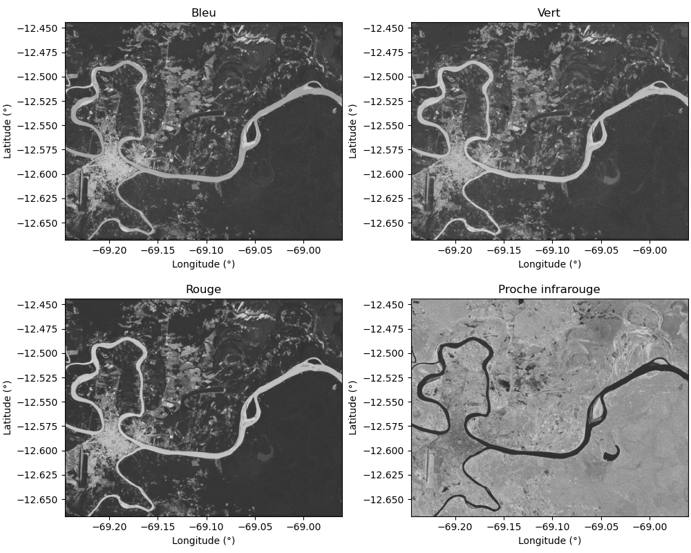

On voit déjà que certaines ressortent plus ou moins dans les différentes bandes : les rivières, les lacs, la ville, les différents types de végétation, etc.

Pour visualiser une image satellite acquise dans différentes bandes de fréquences, on utilise en général une **représentation RGB**.
On sélectionne 3 bandes, on assigne à chaque bande une couleur, et on superpose les 3 images pour obtenir une seule image en "couleurs".

Pour fusionner 3 matrices `img_red`, `img_green` et `img_blue` correspondant à 3 bandes d'une image que l'on veut afficher en RGB, il suffit de les concaténer avec `numpy` :

~~~
img_rgb = np.stack((img_red,img_green,img_blue),axis=-1)
~~~

Par défaut, l'échelle de couleur de la méthode `imshow` sera la bonne.

Le plus classique est d'afficher en rouge la bande du rouge, en vert la bande du vert, et en bleu la bande du bleu.
C'est ce que l'on appelle une image en **vraies couleurs**, car il se rapproche des couleurs telles que les percevrait notre oeil.

Voici ce que cela donne avec notre image Sentinel 2 :

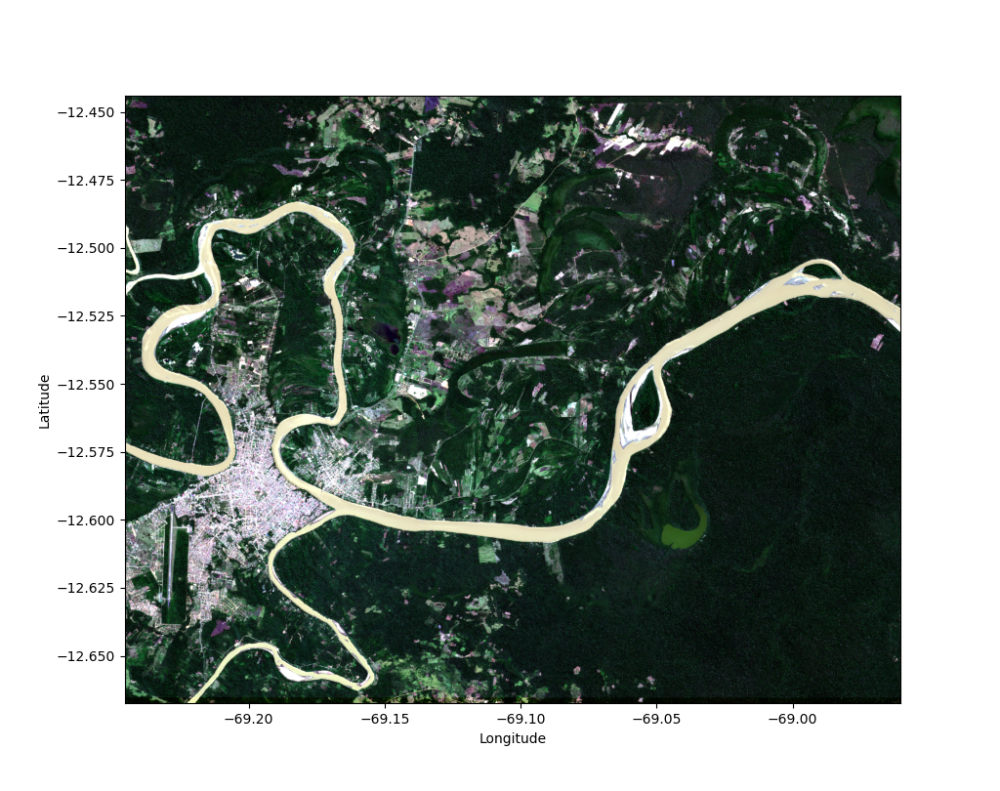

On peut également réaliser un affichage **fausses couleurs**.
Le plus commun est de mettre en rouge le proche-infrarouge, en vert le rouge, et en bleu le vert.

En effet, ce type d'affichage permet de bien faire ressortir la végétation des étendues d'eau ou des villes.

Voici ce que cet affichage donne sur notre image Sentinel 2 :

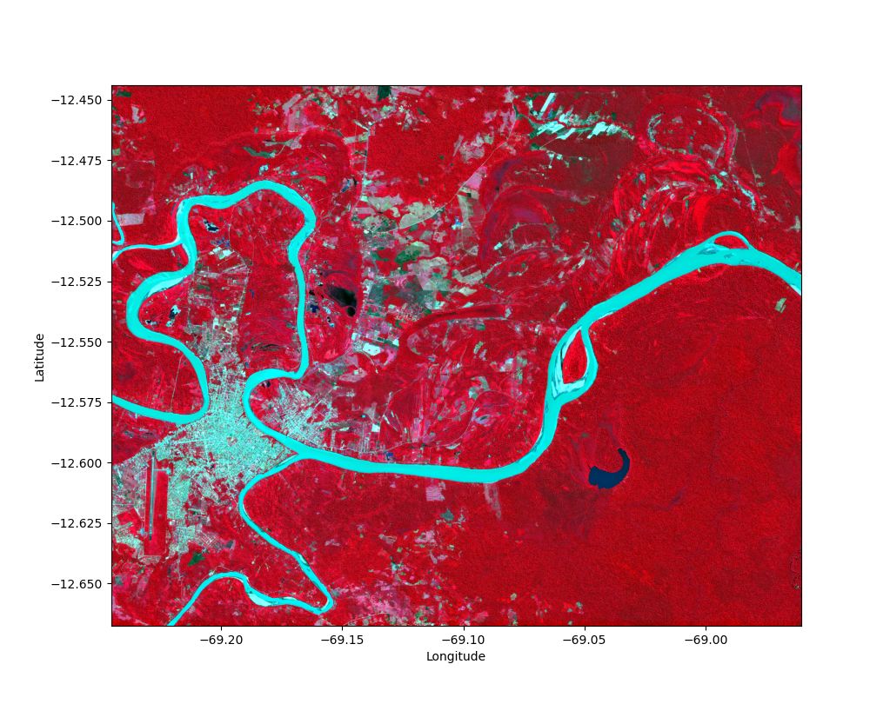

La végétation ressort nettement en teintes de rouge, alors que les rivières et la ville ressortent en bleu.

|Nota Bene|
|:-|
|Il est possible que les images en "vraie couleurs" vous paraissent avoir des couleurs un peu surnaturelles.|
|C'est normal, les caméras de Sentinel 2 n'aquièrent pas exactement les mêmes longueurs d'onde que les cellules de notre rétine.|
|Si vous étiez dans l'espace, vous ne vériez donc pas tout à fait les mêmes couleurs avec votre oeil.|

Ces quelques affichages semblent confirmer la pertinence d'utiliser la "couleurs" des pixels de l'image dans ces 4 bandes pour classifier les types de surface au sol.

## Classification supervisée

### L'apprentissage supervisé

_Comment "apprendre" à un classifieur à reconnaitre un pixel de forêt, de champs, de ville ou de rivière à partir de sa couleur ?_

Dans ce tutoriel, nous allons utiliser une méthode appelée "**l'apprentissage supervisé**".

En "apprentissage automatique" (ou "Machine-Learning" en anglais), on essaye d'enseigner à un modèle comment renvoyer les sorties attendues à partir d'une sélection d'entrées.

Suivant la nature de la sortie, on parlera de :

* **Régression** si la sortie est quantitative et continue.

* **Classification** si la sortie est quantitative discrète ou qualitative.

Comme ici notre sortie est un "label" (ou "étiquette") que nous voulons attribuer à un pixel à partir des valeurs qu'il contient dans les différentes bandes, nous sommes clairement face à un problème de "**classification**".

L'expression "**supervisée**" vient du fait que pour enseigner à notre modèle comment prédire les labels corrects pour les pixels de l'image, nous allons lui fournir des exemples de pixels **déjà labélisés** pour qu'il puisse s'**entrainer**.

Au cours de l'entrainement, le modèle peut donc comparer ses prédictions aux labels attendus pour cet exemple, d'où le côté "supervisé".

La classification supervisée implique que nous ayons une **connaissance du terrain** dont sont issus nos pixels d'exemple.

Par opposition, ce que l'on appelle "classification non-supervisée" serait ici le fait de séparer les pixels en différents groupes suivant les valeurs qu'ils contiennent dans les différentes bandes, sans a priori sur l'identification des pixels.
On parle aussi de "clustering" ou "**partitionnement**".
Nous en reparlerons lors du TP suivant.

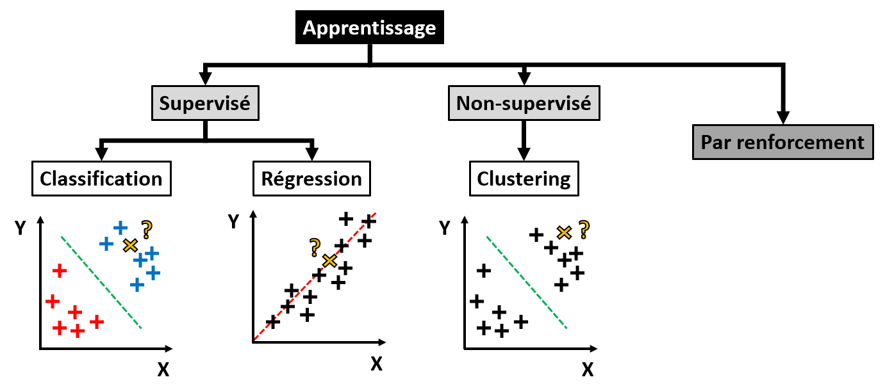

### Base de données labélisée

Pour pouvoir entrainer un modèle à identifier un pixel, il nous faut **une base de données de pixels labélisés**.

Nous allons donc sélectionner des rectangles de pixels dans notre Sentinel 2, pour lesquels nous sommes certains de l'identification.

Voici une fonction toute faite pour la sélection de pixels dans 4 GeoTIFF `blue`, `green`, `red` et `nir`, entre les latitudes `lat_min` et `lat_max`, et les longitudes `lon_min` et `lon_max`.
L'utilisateur peut choisir d'attribuer aux pixels le label qu'il souhaite avec le paramètre `label`.
L'intensité des pixels sélectionnés dans les différentes bandes et le label assigné seront ajoutés à un dictionnaire, renvoyé en sortie de la fonction :

~~~
def add_sample(blue,green,red,nir,lon_min,lon_max,lat_min,lat_max,label,dict_dataset={'blue':[],'green':[],'red':[],'nir':[],'label':[]}):
    
    window = rasterio.windows.from_bounds(left=lon_min,bottom=lat_min,right=lon_max,top=lat_max,transform=geotiff_blue.transform)
    
    sample_blue = geotiff_blue.read(1,window=window)
    sample_green = geotiff_green.read(1,window=window)
    sample_red = geotiff_red.read(1,window=window)
    sample_nir = geotiff_nir.read(1,window=window)
    
    dict_dataset['blue'] += list(sample_blue.ravel())
    dict_dataset['green'] += list(sample_green.ravel())
    dict_dataset['red'] += list(sample_red.ravel())
    dict_dataset['nir'] += list(sample_nir.ravel())
    
    dict_dataset['label'] += [label]*sample_blue.size
    
    return dict_dataset
~~~

Voici par exemple une commande pour ajouter un rectangle de pixels correspondant à de la forêt, à un dictionnaire nouvellement créé :

~~~
dict_dataset = add_sample(geotiff_blue,geotiff_green,geotiff_red,geotiff_nir,-68.985,-68.965,-12.595,-12.585,'forest')
~~~

Pour ajouter des pixels correspondant à de la ville à ce même dictionnaire, on peut utiliser une commande similaire à celle-ci :

~~~
dict_dataset = add_sample(geotiff_blue,geotiff_green,geotiff_red,geotiff_nir,-69.196,-69.182,-12.602,-12.590,'city',dict_dataset)
~~~

**Ajoutez cette fonction à votre script, et créez un dictionnaire contenant des sélection de pixels pour la forêt, les champs, la ville et l'eau.**

Pour faire ceci, vous pouvez vous servir de votre affichage RGB géolocalisé de l'image Sentinel 2, ou d'un service de cartographie en ligne pour vérifier la nature des sols.

Voici l'exemple de sélection qui a été utilisé pour obtenir les résultats montrés dans ce tutoriel :

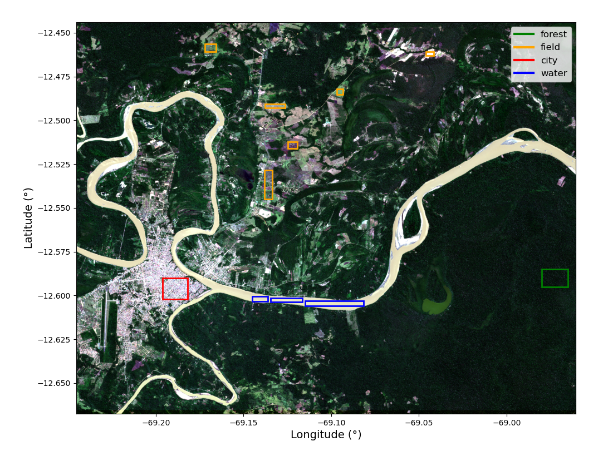

Un fois le dictionnaire obtenu, il pourra être transformé en DataFrame `pandas` :

~~~
df_dataset = pd.DataFrame(dict_dataset)
~~~

Les DataFrames sont en effet couramment utilisés sous Python pour fournir des données à des méthodes de Machine-Learning.
Les colonnes correspondent en général aux variables d'entrée (ici les intensités des pixels dans les 4 bandes de l'image), et aux labels (ici l'identification du sol).
Les lignes correspondent aux différents individus de la base de données (ici les pixels).

Il ne faudra pas oublier d'importer `pandas` en début de script :

~~~
import pandas as pd
~~~

C'est bon, nous avons notre **base données d'entrainement** !

### Classifieur Naive Bayes

Il nous faut à présent choisir un type de modèle à entrainer.

Une des méthodes de base pour la classification supervisée est la "**décision Bayésienne**" (ou "Naive Bayes" en anglais).

Le principe est le suivant : essayer d'estimer la probabilité conditionnelle d'un pixel d'avoir un label sachant les valeurs qu'il contient.
Le label ayant **la plus grande probabilité conditionnelle** est attribué à ce pixel.

Comme son nom l'indique, cette méthode va déterminer la probabilité conditionnelle de chaque classe en se basant sur la **formule de Bayes**.

Un **modèle Gaussien** est d'abord ajusté à la distribution des pixels au sein de chaque label dans les données d'entrainement grâce à l'algorithme du "maximum de vraisemblance" (ou "maximum likelihood" en anglais).
Ce modèle est ensuite utilisé dans la formule de Bayes pour calculer les probabilités conditionnelles de n'importe quel pixel pour chaque classe.

Par exemple, si nous voulons classer des individus en 3 classes $C_1$, $C_2$ et $C_3$ à partir d'une variable $x$ :

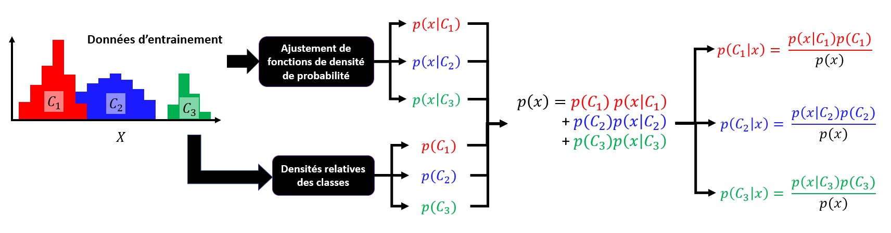

On peut tracer une **frontière de décision** entre les labels en traçant la ligne des valeurs de pixels pour lesquelles les probabilités conditionnelles entre 2 labels sont égales.

Voici une illustration de la méthode pour un exemple simple avec une image satellite acquise dans 2 bandes, et 2 labels possibles pour les pixels :

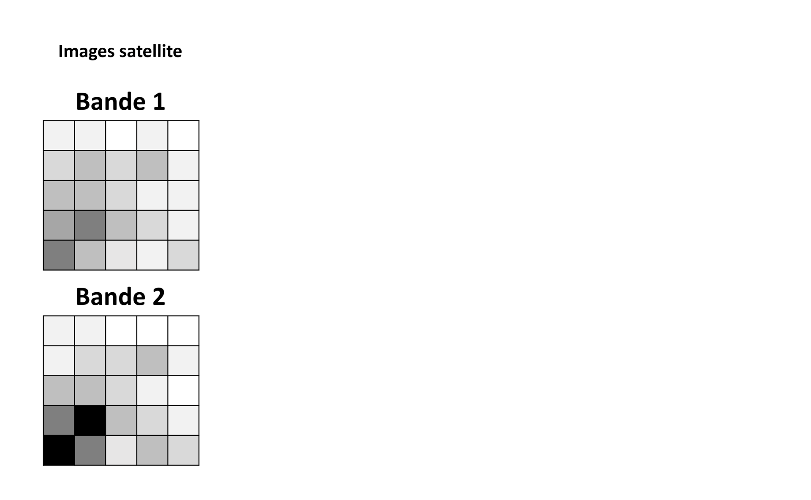

Il existe une implémentation de cette méthode dans la bibliothèque Python `scikit-learn`, que nous allons utiliser lors de ce tutoriel.

Si cette méthode est beaucoup plus basique que les réseaux de neurones actuels, elle est aussi beaucoup plus rapide à entrainer, et peut donner des résultats très satisfaisants selon les applications.

|Nota Bene|
|:-|
|Il est possible d'utiliser d'autres fonctions qu'une Gaussienne pour modéliser les différentes classes.|
|Mais par défaut, on sous-entend souvent que la "décision Bayésienne" est à modèle Gaussien.|

### Pipeline Scikit-Learn

Les outils de **Machine-Learning** que nous utiliserons lors de ce tutoriel sont tous contenus dans la bibliothèque `scikit-learn`.

Pour commencer, cette bibliothèque permet de définir un type d'objet que l'on appelle un "**Pipeline**".
Il permet de créer une petite chaîne pouvant contenir des pré-traitements des données d'entrée, un classifieur, et des post-traitement des labels de sortie.

Pour notre application, nous allons définir un Pipeline contenant une **mise à l'échelle** puis un classifieur "**Naive Bayes**".

En effet, il est recommandé de mettre à l'échelle les différentes variables d'entrée d'un classifieur, pour éviter de biaiser son entrainement : il risquerait de donner plus de poids à une variable simplement parce qu'elle a des valeurs numériques plus grandes.

Pour éviter ce problème, nous choisissons la fonction "**centrage-réduction**" ("standard scaler" en anglais), qui consiste juste en un retrait de la moyenne et une division par l'écart-type de chaque variable.
La moyenne des variables devient alors 0, et leur écart-type 1.

En début de script Python, il faudra importer l'objet "Pipeline" de `scikit-learn`, le centrage-réduction, et la méthode de la décision bayesienne :

~~~
from sklearn.pipeline import Pipeline
from sklearn.preprocessing import StandardScaler
from sklearn.naive_bayes import GaussianNB
~~~

Pour définir une Pipeline `classifier_pipeline` avec une mise à l'échelle nommée `scaler`, et un classifieur nommé `gnb`, on pourra utiliser la commande :

~~~
classifier_pipeline = Pipeline([('scaler',StandardScaler()),('gnb',GaussianNB())])
~~~

**Ajoutez la définition de ce Pipeline à votre script Python.**

Il nous faut maintenant entrainer ce Pipeline sur notre base de données.

## Entrainement

### Ajustement du modèle

Il est très simple d'entrainer un Pipeline `scikit-learn` : il suffit d'utiliser la méthode `fit`, avec en paramètres les variables d'entrée et les labels de la base de données d'entrainement.
En Machine-Learning, les variables d'entrée d'un classifieur sont appelées "**features**", et les sorties sont appelées "**labels**".

Dans un premier temps, il faut sélectionner les "features" et les "labels" de notre base de données d'entrainement :

~~~
features = df_dataset.drop(columns=['label'])
labels = df_dataset['label']
~~~

Ensuite, on appelle `fit` avec en paramètres les "features" et les "labels" :

~~~
classifier_pipeline.fit(features,labels)
~~~

**Ajoutez à votre script Python l'entrainement de votre Pipeline.***

Et voilà, nous avons un Pipeline entrainé à classifier les pixels de notre image !
Reste à vérifier avec quelle performance.

### Performances en entrainement

Pour évaluer les performances d'un classifieur, il faut vérifier s'il est bien capable de **prédire des labels connus**.

La méthode `predict` d'un Pipeline permet de réaliser une prédiction à partir de "features" donnés :

~~~
prediction = classifier_pipeline.predict(features)
~~~

On peut donc appliquer la méthode `predict` aux features de notre base de données d'entrainement, afin de vérifier que l'on obtient bien les labels attendus.

Pour une prédiction d'un label donné, il existe **4 situations** :

* **TP** : les vrais positifs, ce label a été prédit et c'était le bon label.

* **TN** : le vrais négatifs, ce label n'a pas été prédit et ce n'était pas le bon label.

* **FP** : les faux positifs, ce label a été prédit mais ce n'était pas le bon label.

* **FN** : les faux négatifs, ce label n'a pas été prédit mais c'était le bon label.

Pour toutes les prédictions effectuée sur une base de données labélisée, on met en général les résultats sous la forme d'une "**matrice de confusion**".

Les colonnes correspondent aux labels prédits, les lignes aux labels corrects, et chaque case contient le nombre d'occurences.

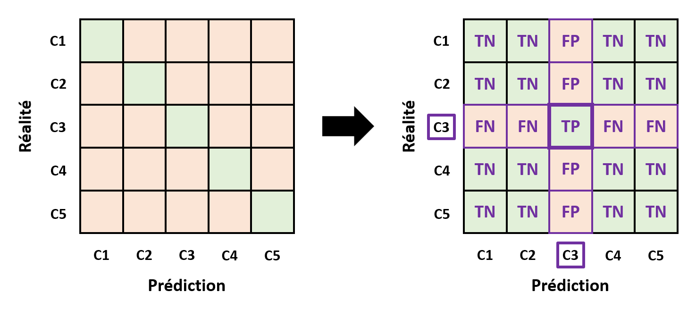

De manière générale, la diagonale correspond aux **prédictions correctes**, et le reste de la matrice aux **prédictions incorrectes**.

On peut aussi déterminer le nombre de TP, TN, FP et FN du point de vue d'un label donné.

Il existe une implémentation de la matrice de confusion dans `scikit-learn`, que l'on peut importer avec :

~~~
from sklearn.metrics import confusion_matrix,ConfusionMatrixDisplay
~~~

L'objet `confusion_matrix` permet de créer une matrice de confusion à partir de labels connus et de labels prédits, la méthode `ConfusionMatrixDisplay` permet ensuite d'afficher cette matrice sous la forme d'une figure.

Voici comment utiliser cette méthode avec notre Pipeline, sur notre base de données d'entrainement :

~~~
set_labels = sorted(set(labels))
cm = confusion_matrix(labels,classifier_pipeline.predict(features),labels=set_labels)
ConfusionMatrixDisplay(confusion_matrix=cm,display_labels=set_labels).plot()
~~~

Voici un exemple de matrice de confusion obtenue avec la sélection de pixels d'entrainement montrée précédemment :

La matrice de confusion permet de déterminer quelles classes sont plus difficiles à prédire que d'autres, et avec quelles classes elles sont confondues par le modèle.
Mais elle est moins pratique pour comparer rapidement 2 modèles, ou un même modèle sur 2 bases de données labélisées.

On lui préfèrera donc **un score entre 0 et 1**, déterminé à partir de la matrice de confusion.

## Test

### La problématique du sur-apprentissage

En Machine-Learning, le nerf de la guerre est la **généralisation**.

En effet, un modèle qui a d'excellente performances sur les données d'entrainement, mais de mauvaises performances sur n'importe quelles autres données **ne sert à rien**.
On veut que le modèle soit capable de **généraliser** ce qu'il a apprit.

Ceci peut arriver lorsqu'un modèle apprend **trop spécifiquement** des données d'entrainement.
C'est ce que l'on appelle le **sur-apprentissage**, et c'est la hantise de tous les "data-scientists".

Voici une illustration sur un problème de régression :

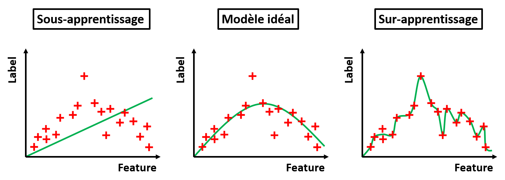

Le modèle de gauche est visiblement trop simpliste pour capturer la tendance principale des données : on parle de **sous-apprentissage**.

Le modèle de droite est visiblement trop complexe, et capture même le bruit dans les données d'entrainement.
Il aura donc d'excellentes performances sur les données d'entrainement, mais aura du mal à généraliser : il y a **sur-apprentissage**.

Le modèle **idéal** est au milieu : assez complexe pour capturer la tendance principale des données d'entrainement, sans aller jusqu'à apprendre le bruit dans les données.

Le **sur-apprentissage** peut avoir différentes origines :

* Trop peu de données d'entrainement.

* Des données d'entrainement pas assez représentatives.

* Des données de mauvaise qualité (mauvais labels, déséquilibre entre labels, etc.).

* Un type de modèle trop complexe.

* Trop peu de d'entrées au modèle.

Dans le contexte de notre tutoriel, en cas de de sur-apprentissage, nous pourrions essayer :

* D'ajouter des pixels à vos données d'entrainement.

* De re-faire votre base de données d'entrainement avec des zones plus représentatives.

* Ajouter des bandes pertinentes à vos données d'entrainement.

Mais reste alors une question : _Comment détecter un sur-apprentissage ?_

Nous allons évaluer les performances du modèle sur une nouvelle sélection de données, jamais vue par le modèle pendant l'entrainement.
Ce que l'on appelle une **base de données de test**.

Si le classifieur performe aussi bien en test qu'en entrainement, on en déduira que l'**on peut s'attendre à de bonnes performances en généralisation**.

### Performances en test

## Généralisation

### Application à l'image entière

### Evaluation de la surface de forêt

---